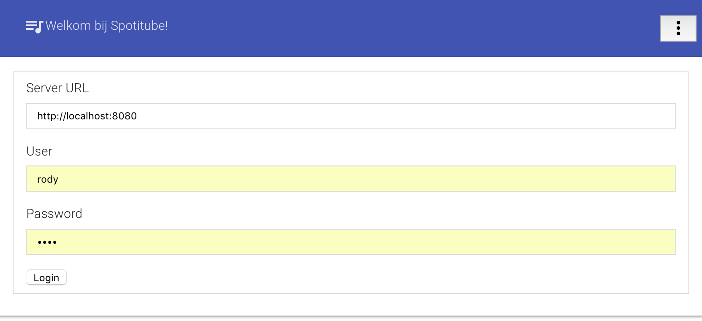
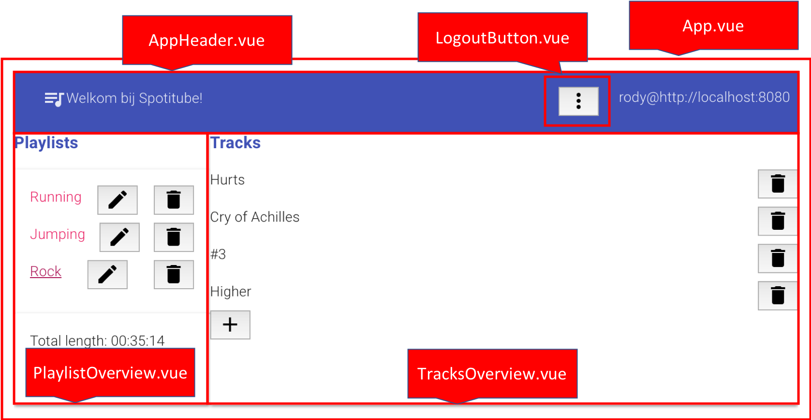
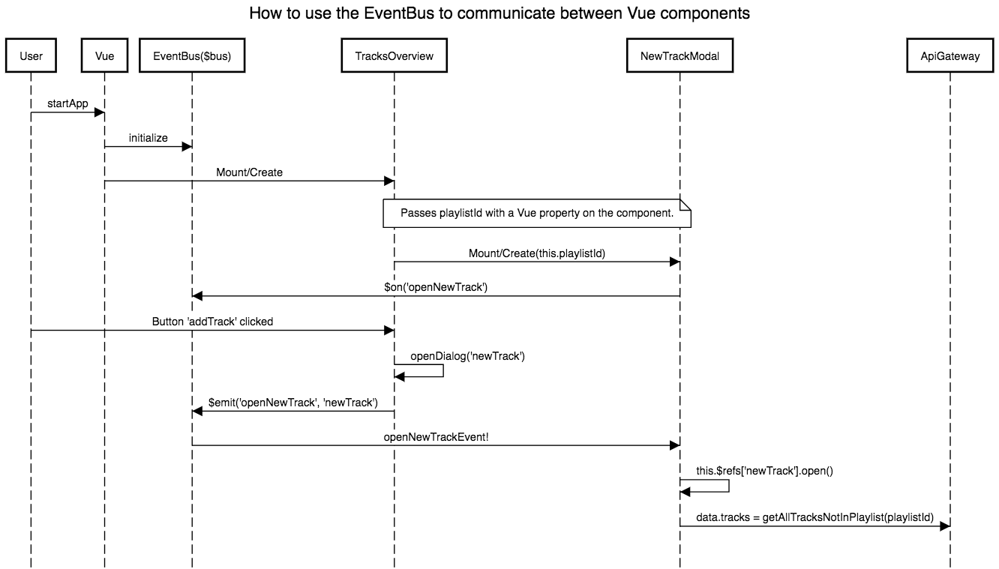

---
title: "Example Vue: Spotitube"
subject: "An example to learn Vue.js 2.0"
titlepage: true
titlepage-color: AF9162
titlepage-text-color: ffffff
titlepage-rule-color: ffffff
titlepage-rule-height: 1
toc-title: "Table of contents"
...

Preface
=======

In this example we'll use a simple case study called 'Spotitube' (a mashup between Spotify and YouTube to enable playlists with songs and videos) to demonstrate and explain the following features of Vue (or its companion libraries):

Prerequisites
=============
To use this example you need to install the following tools:

* Node.js (>=4.x, 6.x preferred)
* Npm (minimum version >= 3.0)
* Git
* A JavaScript IDE (WebStorm is free to use with a [student license](http://jetbrains.com/student) from JetBrains)
* Vue.js [devtools extension](https://chrome.google.com/webstore/detail/vuejs-devtools/nhdogjmejiglipccpnnnanhbledajbpd) for Chrome, a great tool to inspect events and the structure and state of components. 

How to create, run and lint a project
=====================================
The easiest way to start a new Vue project is to use [Vue CLI](https://github.com/vuejs/vue-cli). When you've installed Vue CLI, you have the following options:

* vue init [webpack](https://github.com/vuejs-templates/webpack) my-project
* vue init [webpack-simple](https://github.com/vuejs-templates/webpack-simple) my-project
* vue init [browserify](https://github.com/vuejs-templates/browserify) my-project
* vue init [browserify-simple](https://github.com/vuejs-templates/browserify-simple)  my-project
* vue init [pwa](https://github.com/vuejs-templates/pwa) my-project
* vue init [simple](https://github.com/vuejs-templates/simple) my-project

For a serious Vue application we need at least unit-testing and the browserify template is the least complex option. Vue init starts a simple dialog, fill in the required fields and answer "Y" when asked for "Use ESLint to lint your code?" and "Setup unit tests with Karma + Jasmine?". 

You can use ```npm run lint``` to see if the JavaScript-code conforms to the ECMAScript-standard. Tools like WebStorm can also lint your code with ESLint or use [SonarLint](https://www.sonarlint.org/intellij/) with the same profile so you can check if your code passed quality checks. 

After creating the project enter the project-directory and run ```npm install``` followed by ```npm run dev```. 

The first command downloads all required libraries, including Karma and PhantomJS to run end-to-end and unit tests. Later we will replace Karma by [Petrol](https://github.com/MGMonge/petrol) because of its simplicity and because it works great with vue-inject and other vue extensions.  

The second command actually runs the application in development mode. When you run the application in Chrome with the devtools extension installed and open the JavaScript console the screen looks like this:


The screen shows the demo application provided with the template. During this example we're going to rebuild the [Spotitube](http://ci.icaprojecten.nl/spotitube/) application in Vue. This application is built in Angular by [Meron Brouwer](https://github.com/meronbrouwer/oose-dea-eai-client), for this example we use a design that looks like the Angular version:




When you look closely to the design, you might notice that some parts of the screen are (with a bit of imagination) reusable in other applications, like the header and a logout button. For this example we chose to split the screen into the following parts:



There are also a few components that are not always visible like:

* the Login component
* some modal dialog components: NewTrackModal, NewPlaylistModal and UpdatePlaylistModal

The start of a Vue application
==============================

A minimal Vue application has a html file and a javascript-file that get connected using a npm-script.
```{.json include="package.json" start="13" stop="13"}
```

When running ```npm run build``` the main.js and all its dependencies get compiled with a tool called [browserify](http://browserify.org/) into a javascript file called build.js. This build.js is the source for the html file:

```{.html include="index.html" start="1" stop="16"}
```

In this HTML-file we refer to several stylesheets:

* build.css, a compile stylesheet by browserify
* modal.css, a custom stylesheet for the application
* two fonts and the css to use the Material style from Google (we'll get back later how to add Vue Material to a Vue application)

The input for the ```npm run build``` steps is the main.js file:

```{.javascript include="src/main.js" start="4" stop="21"}
```

This specific file is extended with extra libraries for Vue like [vue-localstorage](https://www.npmjs.com/package/vue-localstorage), [vue-inject](https://www.npmjs.com/package/vue-inject) and [vue-material](https://www.npmjs.com/package/vue-material). It also has a few custom classes that we're going to use later on. The minimal setup for a main.js is:

```{.javascript include="src/main.js" start="4" stop="5"}
```
```{.javascript include="src/main.js" start="18" stop="21"}
```

The el property refers to the element-id: 
```{.html include="index.html" start="13" stop="13"}
```
The render method renders a Vue component called App.vue, let's see what the anatomy of a Vue component looks like.


The anatomy of a Vue Component
==============================
Every Vue component has at least a template (the _view_)and most of the time also some 'code behind' (a combination of a _model_ and a _controller_). In the following paragraphs we'll use the App.vue component from the Spotitube application to show its parts. 

Templates (View)
----------------
The first part of the Vue components is the template:

```{.html include="src/App.vue" start="1" stop="10"}
```

Every template starts with a template tag and within the template tag some ordinary HTML-tags. Well, ordinary, you might notice tags like ```app-header``` and ```login```. These tags refer to the names of other Vue components. Some components have some an extra Vue-attribute: ```v-if```. This is called a _directive_ and it can be used on a single tag or on a container tag like a div or even a template tag. This directive is used to do _conditional rendering_ and can be used together with ```v-else-if``` and ```v-else``` but also has an alternative ```v-show```. Look at the [Vue documentation](https://vuejs.org/v2/guide/conditional.html#v-if-vs-v-show) for the exact difference. In de App.vue component the playlists-overview and playlit-overview components are only showed when a certain variable gets set.

One of the components that is placed on the App.vue components is the Login component. Before we take a look at the code behind the controller the Login components shows us two nice features of Vue called _data binding_ and _event handling_:

```{.html include="src/components/Login.vue" start="1" stop="25"}
```

There are three HTML elements with a ```v-model``` attribute set. This attribute causes a two-way binding between the template and its data: when a user changes the input, the data is changed and vice versa (e.g. when the data is altered by a REST-call). The login template also has a button, when it gets clicked the method ```executeLogin``` is executed. But where is this method located? And where is the data located for the ```v-if``` and ```v-model``` directives?

When you need component specific CSS you can add a ```style``` tag at the bottom of the .vue file, these styles can be scoped so they can only be used by this single component:

```{.css include="src/App.vue" start="47" stop="52"}
```

Behaviour (Model: data and Controller: methods)
-----------------------------------------------
The behaviour of a Vue component is determined by its methods and it data. Let's first take a look at the behaviour of the App.vue component:

```{.javascript include="src/App.vue" start="12" stop="26"}
```
```{.javascript include="src/App.vue" start="37" stop="45"}
```

It starts (and ends) with a ```script``` tag and a few imports to locate the inner components like the Login.vue component which are contained in a property called ```components```. The name is set by a property called name and together with a data property it it contained in a simple JavaScript object (```{}```). This components also contains a property (a _lifecycle hook_) called ```created```, the lines in this property are executed when the components gets created during the lifecycle. Besides the created hook a Vue component can contain [other hooks](https://vuejs.org/v2/guide/instance.html#Instance-Lifecycle-Hooks):

* beforeCreate
* beforeMount
* mounted
* beforeUpdate
* updated
* beforeDestroy
* destroy

In this example we only use the created hook. 

The App.vue components has no methods, however the Login.vue component has:

```{.javascript include="src/components/Login.vue" start="27" stop="31"}
```
```{.javascript include="src/components/Login.vue" start="36" stop="48"}
```
```{.javascript include="src/components/Login.vue" start="54" stop="56"}
```

The method ```executeLogin``` is executed when the button with id "loginButton" is clicked. This method delegates it behaviour to a helper object called apiGateway (implements Fowler's [Gateway pattern](https://martinfowler.com/eaaCatalog/gateway.html))from the 'class' (between quotes for now, but you can actually use classes with TypeScript) ApiGateway. This helper object is used in the list of dependencies, a non standard property of a Vue component. Non standard because it is used by a companion library called ```vue-inject``` that adds dependency injection capabilities to Vue. Instead of creating an instance (or reference) to the ApiGateway we rely on vue-inject to do that for us. This makes our code cleaner and improves testability. 

The vue-inject library is already added to the main.js and it's going to resolve all the dependencies of components by looking at its reference name ('apiGateway') and looking it up in the injector. For the ApiGateway to be found by vue-inject it must register itself with the injector (method contents of ApiGateway are left empty to improve readability):

```{.javascript include="src/api/apigateway.js" start="1" stop="5"}
```
```{.javascript include="src/api/apigateway.js" start="18" stop="20"}
```
```{.javascript include="src/api/apigateway.js" start="28" stop="30"}
```
```{.javascript include="src/api/apigateway.js" start="38" stop="40"}
```
```{.javascript include="src/api/apigateway.js" start="52" stop="54"}
```
```{.javascript include="src/api/apigateway.js" start="66" stop="68"}
```
```{.javascript include="src/api/apigateway.js" start="76" stop="78"}
```
```{.javascript include="src/api/apigateway.js" start="86" stop="88"}
```
```{.javascript include="src/api/apigateway.js" start="96" stop="98"}
```
```{.javascript include="src/api/apigateway.js" start="106" stop="109"}
```

The injector is imported together with the Axios library which is used to create REST calls later in the example. The last line of the ApiGateway injects an instance to the application with the name 'apiGateway' so it can be resolved by vue-inject when components have one or more dependencies.

How to unit-test components
===========================
Since we use dependency injection in our components we can stub or mock dependencies per component. But first we need a proper testcase and a test runner. When you use ```vue-cli``` it adds Karma (a test runner), Jasmine (a test dialect with asserts) and PhantomJS (a headless browser to run the code in/with). During the development of the Spotitube example we stumbled upon [Petrol](https://github.com/MGMonge/petrol) which is very simple to use and it works great together with vue-inject (unline Karma). 

To switch from Karma to Petrol we need to change the package.json file on two places. Change the scripts.test property to the following value:

```{.json include="package.json" start="12" stop="12"}
```
 
Also add Petrol to the list of devDependencies:

```{.json include="package.json" start="56" stop="56"}
```

Let's build a test for our Login.vue component which has dependencies on the ApiGateway and the LocalStorage. When the test is not run in an actual browser the LocalStorage is not available and the build a unit test (instead of an integration test) we need to stub or mock the ApiGateway:

```{.javascript include="test/LoginTest.js"}
```

A Petrol testcase for Vue Components extends the VueTestCase class so we can refer to the SUT ([Subject Under Test](https://testing.googleblog.com/2013/07/testing-on-toilet-know-your-test-doubles.html)) and the mount function to trigger the mount and created hooks on the component. Petrol has a beforeEach (```@Before``` in JUnit) that is called before every test function. A test function starts with test or gets annotated with ```/** @test */```. 

In a test function you can refer to the component with ```this.SUT``` and to several cool VueTestCase functions like:
 
* ```this.assertEquals```, asserts that determine the pass/failure of the testcase
* ```this.fillField```, fill a field like a user should. First parameter is a [querySelector](https://developer.mozilla.org/en-US/docs/Web/API/Document/querySelector), second parameter is the value to fill the field with.  
* ```click```, forces a click event on a HTML-element given the querySelector

Properties (data-fields) can be read easily, e.g. ```this.SUT.token```. For this testcase two test doubles (stubs) are used in combination with vue-inject:

```{.javascript include="test/LoginTest.js" start="7" stop="9"}
```

This makes the Login.vue use the stubs instead of the real dependencies. The stubs are prepared to generate return values just to make the tests pass:

```{.javascript include="test/stubs/apigateway.js" start="1" stop="6"}
```
```{.javascript include="test/stubs/apigateway.js" start="84" stop="86"}
```

In this testcase we also see a call to a module called EventBus which is used to pass data between non-related (not in a parent-child hierarchy) components. More about the EventBus in the section "Between non-related components: using a simple event-bus". 

How to exhange data between components
======================================
Good components have a clear interface and follow good design guidelines like low coupling and high cohesion. Vue components also have a clear boundary and besides their dependencies on helper classes in most cases these components don't "know" about other components' existence which is a good point from a design point of view but as a developer you need to exchange data between these components, what are your options?

Between a parent and child component: properties
------------------------------------------------
When a component has child components there is a strong relation between these components but there is no object reference to access data or methods. To exchange data between parent and child components Vue has _properties_ defined by the props attribute. Suppose we need to add tracks to a selected playlist, how are we going to pass the selected playlist from the TracksOverview.vue component to a modal dialog to select a new track for this playlist?

Given the following template of the TracksOverview.vue component:

```{.html include="src/components/TracksOverview.vue" start="1" stop="20"}
```
```{.javascript include="src/components/TracksOverview.vue" start="21" stop="28"}
```
```{.javascript include="src/components/TracksOverview.vue" start="39" stop="49"}
```
```{.javascript include="src/components/TracksOverview.vue" start="60" stop="62"}
```

A cool thing about this template is that is also shows a Vue directive called ```v-for``` that can be used to iterate over a collection (e.g. an array). The template of the TracksOverview.vue components refers to a child component called NewTrackModal, a modal dialog for the user to select a track to add to the current playlist. The TracksOverview.vue has a playlistId and passes it to the dialog:

```{.html include="src/components/TracksOverview.vue" start="17" stop="17"}
```

The :playlistid property refers to a defined property in the code behind of the NewTrackModal.vue component:

```{.javascript include="src/components/NewTrackModal.vue" start="20" stop="37"}
```
```{.javascript include="src/components/NewTrackModal.vue" start="57" stop="58"}
```

This _binding_ is one-way instead of the ```v-model``` directive that we used earlier in this example. That means that a child-component can _read_ the property and not alter it, if you try to do so Vue will show an error in the JavaScript-console in the browser. 

Notice that these code snippets also refer to \$bus, a simple event bus to generate (\$emit) and listen to (\$on) developer-defined events. This eventbus is used to determine when the modal dialog has to be shown and hidden, normally a ```v-if``` or ```v-show``` directive would do, but this example depends on Material which needs a special kind of opening and closing dialogs. 
 
Between non-related components: using a simple event-bus
--------------------------------------------------------
In the LoginTest testcase we already saw the EventBus being used. The source code for this module is simple:

```{.javascript include="src/events/event-bus.js"}
```

It creates an instance of Vue and passes it to every JavaScript object using the prototype and makes it accessible with the $bus property. Events can be generated using the $emit function:

```{.javascript include="src/components/TracksOverview.vue" start="47" stop="49"}
```

Events can be received using the $on function, in most cases we start listening to incoming events in the created hook:

```{.javascript include="src/components/NewTrackModal.vue" start="32" stop="37"}
```

This sequence diagram shows how the components work together using a property and the event-bus to open a dialog:

<!-- title How to use the EventBus to communicate between Vue components -->
<!-- User->Vue: startApp -->
<!-- Vue->EventBus($bus):initialize -->
<!-- Vue->TracksOverview:Mount/Create -->
<!-- note over NewTrackModal,TracksOverview:Passes playlistId with a Vue property on the component. -->
<!-- TracksOverview->NewTrackModal:Mount/Create(this.playlistId) -->
<!-- NewTrackModal->EventBus($bus):$on('openNewTrack') -->
<!-- User->TracksOverview: Button 'addTrack' clicked -->
<!-- TracksOverview->TracksOverview: openDialog('newTrack') -->
<!-- TracksOverview->EventBus($bus): $emit('openNewTrack', 'newTrack') -->
<!-- EventBus($bus)->NewTrackModal: openNewTrackEvent! -->
<!-- NewTrackModal->NewTrackModal: this.$refs['newTrack'].open() -->
<!-- NewTrackModal->ApiGateway:data.tracks = getAllTracksNotInPlaylist(playlistId) -->



Between non-related components: using a shared store component
--------------------------------------------------------------
The Vue documentation advises to only use the event-bus in simple cases and to use a shared store component in more complex cases. Vue offers several ways to handle state management:

* [Vuex](https://github.com/vuejs/vuex), a [flux-like](https://github.com/facebook/flux/tree/master/examples) implementation
* Reacts' [Redux](https://github.com/egoist/revue) with simple bindings to use in Vue
* Build a simple store component [yourself](https://vuejs.org/v2/guide/state-management.html#Simple-State-Management-from-Scratch)

Look into one or more of these options yourself when the event-bus solutions gets to messy or untestable. 

How to communicate with REST services using Axios
-------------------------------------------------
How does a Vue application communicate with a backend? Due to its simplicity Vue doesn't have features to communicate with REST-services but it's easy to extend Vue with extra libraries, for this example we use [Axios](https://github.com/axios/axios), a promise based HTTP client. 

Axios supports all HTTP verbs by providing seperate functions (get, post, delete, put, etc.) but you can also use a generic request and tell Axios what verb to use.

Before you can use Axios, it need to be added to the package.json file:

```{.json include="package.json" start="24" stop="25"}
```
```{.json include="package.json" start="31" stop="31"}
```

Libraries like Axios work asynchronous so you need to work with the [Promise API](https://developers.google.com/web/fundamentals/primers/promises) or use a simple callback function, in this example we used a callback function, for instance in the Login.vue component:

```{.javascript include="src/components/Login.vue" start="45" stop="54"}
```

The Login.vue component calls the ApiGateway to request a login and registers a callback function that can be executed by the ApiGateway when the REST-call receives a response:

```{.javascript include="src/api/apigateway.js" start="1" stop="18"}
```
```{.javascript include="src/api/apigateway.js" start="107" stop="109"}
```

Conclusion
----------
Vue is a simple but effective JavaScript library to build Single Page Applications. It has less features than Angular but it can be extended easily with libraries you choose yourself. 